# 院校选择

夏令营汇总 https://github.com/hit-thusz-RookieCJ/CSSummerCamp2021

但是拿不到保研名额也没什么用

只能找那些有帮助考研的政策夏令营

- 招生特别少的、新换考试科目的、新开专业的、招人特别多的
  这四种情况分一般低一些
- 学校的牌子和地理位置最重要，学科评估跟学校科研实力有关，对自己能力帮助不大

**哈工大、东南、北航、北大软微、清华深圳**不考408，需要关注后续政策会不会变化。

学校第一个数字指计科评级、第二个指软件工程评级

## 上交 A,A-

研招办 https://yzb.sjtu.edu.cn/

### 电院

电院研招办 https://yjwb.seiee.sjtu.edu.cn/

招生信息-历史信息里有每年复试分数线

总评=初试（500）+复试（200） 大约是7比3 对初试高比较友好

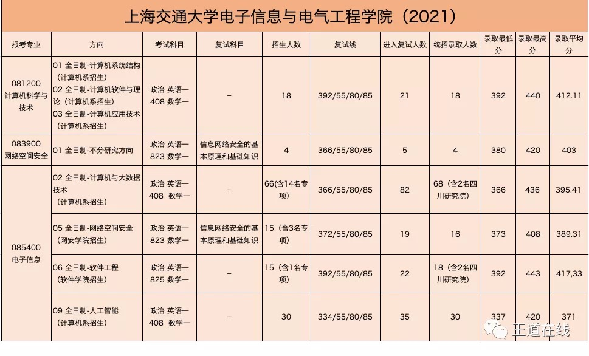

408专硕有两种： 导师一样

1. 大数据
2. 人工智能 两年半学费15w不包住宿，偏向就业

2020年考情

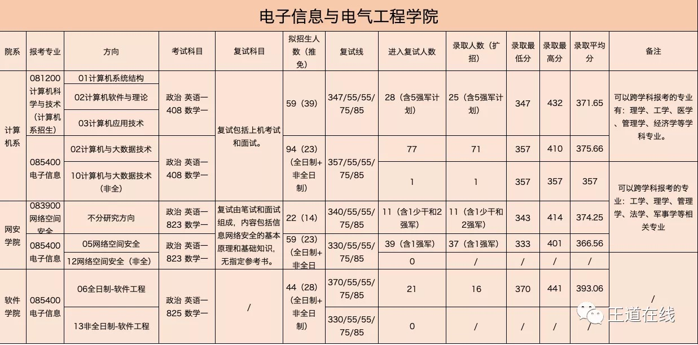

## 浙大 A+,A+

夏令营要求保研资格

总评7：3

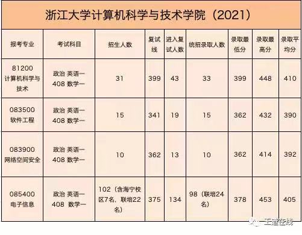

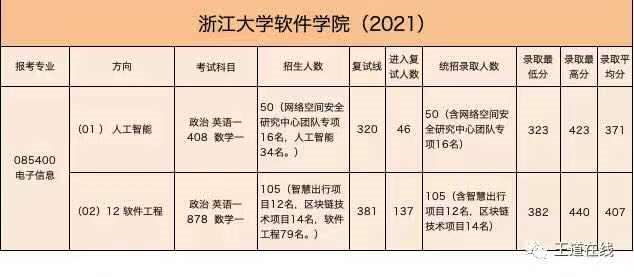

2020年考情分析

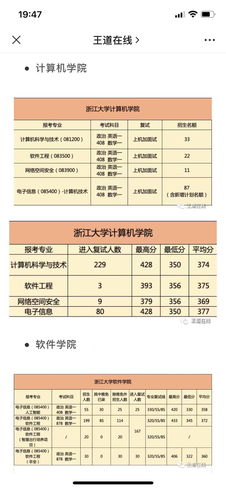

## 北大 A+,A选调优势

可以观察软微会不会改考408。

2021考情分析 https://mp.weixin.qq.com/s/dwu0g7ZfdOyD1brPp_qHHg

复试线：信科350，叉院383，信工374。

复试录取比例：信科30进21（其中结构8，软理6，计应3，计科4，此外计应又收调剂2人，共录23），叉院16进13，信工34进25。

400+人数：信科9个，叉院6个，信工16个。

录取初试最低分数：信科361，叉院387，信工377

录取初试中位分数：信科393，叉院399，信工406

目前来看，21年信工上岸难度明显高于信科，略低于叉院。

作者：斯图尔特张三
链接：https://www.zhihu.com/question/450956809/answer/1806277335

考11408的有:

- 信息科学技术学院 总评1：1

  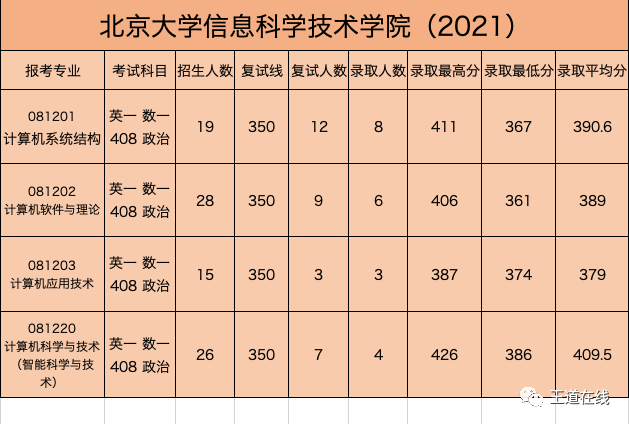

- 叉院（数据科学）总评6：4

  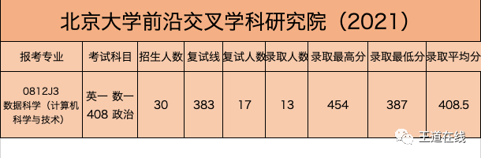

- 信息工程学院  总评6：4 （深圳研究生院）

  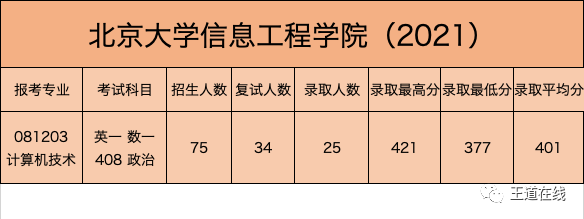

## 南大 A,A

夏令营都要求预计能获得保研资格

11408只有CS院，人工智能院考855（数据结构、算法、人工智能、概率统计）

总评=初试500+上机100+面试150

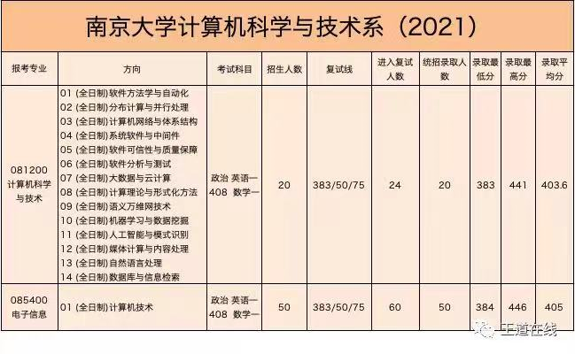

## 华东师范 B+

11408只有计算机学硕

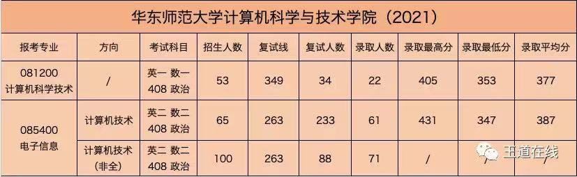

软件A 但是学硕考英1数2，专硕考英2数2

2021考研复试名单：https://yjszs.ecnu.edu.cn/system/ssfsmd_list.asp?yxid=135

## 复旦 B+

夏令营都要求前20%

数一英一408只有计算机学硕

2021年考情

计算机学院 招315人 最低分数线355

官网进入复试的信息 http://www.cs.fudan.edu.cn/?p=33339

**等待王道总结**

2020年考情分析

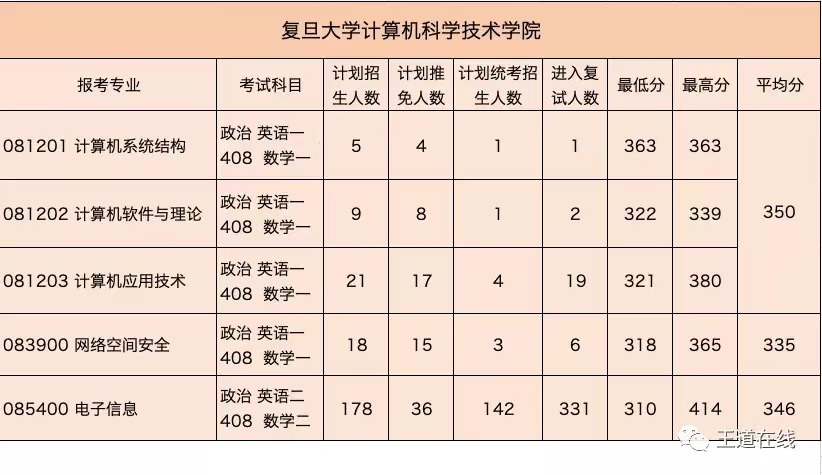

## 同济 A-,A-【夏令营6.21】

招生简章信息：https://yz.tongji.edu.cn/zsjz/sszsjz.htm

夏令营**可报名**：https://yz.tongji.edu.cn/fabu-dianxin2021nianshuqixuexiaohuodongtongzhi.pdf

政策：
	统考优秀学员，若参加 2022 年全国硕士研究生入学考试，且第一志愿报考同济大学电子与信息工程学院相关专业，初试成绩达到同 济大学 2022 年硕士研究生进入复试的基本要求（学术型/工学或专业学位型/工程），可获得我院硕士研究生复试资格。

2021考情还没出

2020考情如下：

学硕分数线可能是多种专业课在一起排名的，需要再看

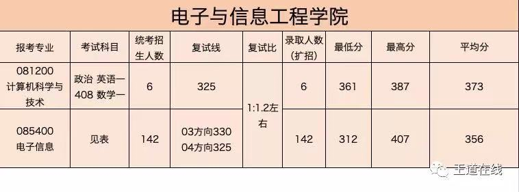

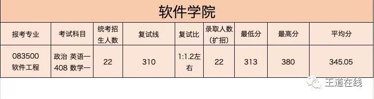

2020考研报录比

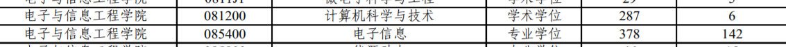

## 武大 A-,A

可以考虑他的计算机

**武大的夏令营需要注册才能报名 **http://gs.whu.edu.cn/info/1056/8371.htm

现有列表里没有计算机 https://ehall.whu.edu.cn/gsapp/sys/wdyjsbm/xly/user/yxList.do?ZSXM_WID=27a85bf318d14136941c6b29749414e7

### 计算机学院

学硕——初试：复试=6：4；

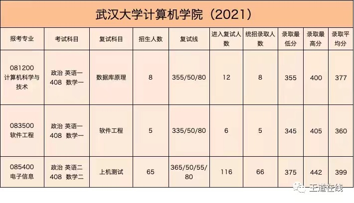

2020年考情

### 国家网安学院

总评6：4

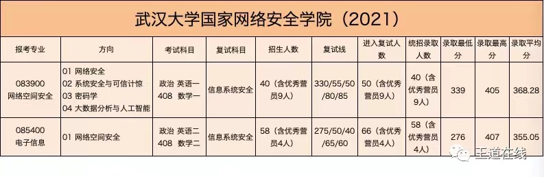

## 华科 A

第一年改考408

只需要关注计院